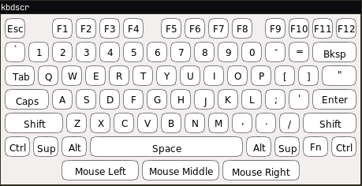

<h1 align="center">kbdscr</h1>

[](https://github.com/geek1011/kbdscr/releases/latest) [](https://cloud.drone.io/geek1011/kbdscr) [](https://ci.appveyor.com/project/geek1011/kbdscr/branch/master)

kbdscr shows evdev button events graphically.

Prebuilt amd64 Debian packages for the latest release are available from the [releases](https://github.com/geek1011/kbdscr/releases) page. There are additional packages available from the artifacts tab of the [AppVeyor builds](https://ci.appveyor.com/project/geek1011/kbdscr/branch/master). Build instructions for other distros are below.

## Screenshots


## Usage

```
KBDSCR(1)                   General Commands Manual                  KBDSCR(1)

NAME
       kbdscr - show evdev button events graphically

SYNOPSIS
       kbdscr layout input_event_evdev_path...

DESCRIPTION
       This  tool  displays button events from evdev devices in a configurable
       on-screen layout. It is often useful for demos, screencasts, and debug‐
       ging input devices.

       This  tool  requires  read  access to the raw evdev devices to use this
       tool.  Usually, this means you need to be root or a member of the input
       group.

OPTIONS
       layout
           The keyboard layout to be displayed.

       input_event_evdev_path
           The  path  to  an evdev device to watch. These are usually found in
           /dev/input/event*. If there are any errors opening or reading  from
           the device, they will be shown as warnings, but will not cause kbd‐
           scr to exit.

LAYOUTS
       The following layouts were defined at the time kbdscr was compiled:

       km-us-en
           US English Keyboard, plus three standard mouse buttons.

       m-logi-m570
           Logitech M570 mouse.

DEFINING NEW LAYOUTS
       To define new layouts, add them to kbd_layout.h  by  defining  a  macro
       which  calls  KBD_LAYOUT. Then, add another entry to KBD_LAYOUTS with a
       unique identifier (without spaces, generally starting with k- for  key‐
       boards,  m-  for  pointing devices, and km- for combinations), a human-
       readable description, and a reference to the macro with the keyboard.

       Each layout consists of the a base size, which  is  used  for  the  row
       height  in  pixels  (keys  spanning multiple rows are not supported), a
       number of units to divide that size into, and the number of units  wide
       each  row  is.  Afterwards,  the keys and spacers are defined. Each key
       consists of the width, the text, and it's evdev keycode (see  linux/in‐
       put-event-codes.h). A spacer is the same as a key, but without the text
       or keycode.

       In the future, a textual format for specifying the  layout  at  runtime
       may be created if necessary.

EXAMPLES
       Show events from all input devices on a US keyboard.
           kbdscr km-us-en /dev/input/event*

       Show events from all input devices on a US keyboard.
           kbdscr km-us-en /dev/input/event*

AUTHOR
       kbdscr was written by Patrick Gaskin <patrick@pgaskin.net>.

                                                                     KBDSCR(1)
```

## Building

At the minimum, kbdscr requires cairo (>= 1.6.4), libxcb, a compiler with C11 support, and a sufficiently modern libc (e.g. glibc 2.9+). To build properly, it also requires bash-completion. During compilation, it also requires gettext for the envsubst command. At runtime, it requires policykit for the desktop launcher to work if the user doesn't have the sufficient permissions to access the evdev devices.

Dependencies (Debian/Ubuntu): `bash-completion gettext-base libcairo2-dev libxcb1-dev make gcc pkg-config policykit-1`, plus `debhelper devscripts dpkg-dev equivs` if building the package.

Dependencies (Fedora/RHEL/CentOS): `bash-completion cairo-devel gettext libxcb-devel make gcc kernel-devel pkgconf polkit`.

To build and install:

```sh
$ make
$ sudo make install
$ make clean
```

To build and install locally:
```sh
$ make PREFIX=$HOME/.local BASH_COMPLETIONSDIR=$HOME/.local/share/bash_completion/completions POLKIT_ACTIONSDIR=
$ make install PREFIX=$HOME/.local BASH_COMPLETIONSDIR=$HOME/.local/share/bash_completion/completions POLKIT_ACTIONSDIR=
$ make clean
```

To build the Debian package:

```sh
$ mk-build-deps --install
$ dpkg-buildpackage -us -uc -tc
```
